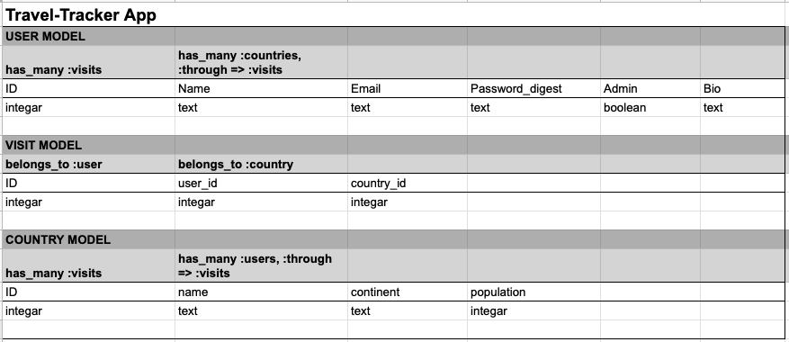
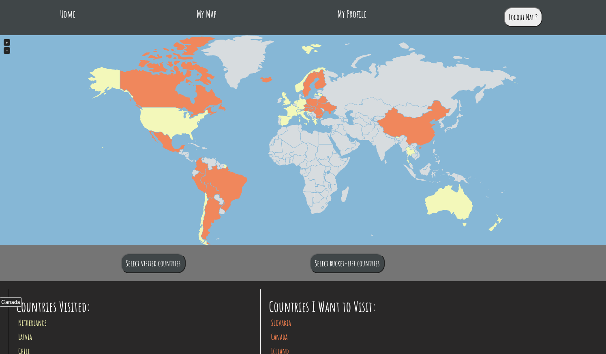

# README

# Project 2: Travel-Tracker App

### The Travel-Tracker App

The purpose of the app is to simulate a scratch-map of the world where users can log in, keep track of the countries they've visited and make a bucket list of the countries they wish to visit. It's a simple app based on three models; Users, Countries and Visits.

See travel tracker [here](https://daniiblack.github.io/react-scratch-map/). **Note: as we are still working out some deployment bugs, users are unable to create a new account. So to login and see the map in action, login with email and password as 'natp@ga.co' and '123'.**

Users can sign up and log in with a password that gets encrypted. To create country lists and interact with the map users must be logged in.

This was a project for training purposes and still a work in progress. It was meant to help us learn how to work as a team to build a website.

We used:
- Ruby on Rails
- HTML/CSS
- Javascript
- React
- Bcrypt gem v.3.1.7


### Approach: Ruby on Rails Back End

At first the User model was created which included secure log in and a user authentication process. This was then tested with React to ensure Rails and React worked together. Then the three models were sketched out in Google sheets to determine the appropriate associations, rows and columns. The associations between the three models were has_many / belongs_to associations without any join tables. Visits and Countries were associated through visits. See table below:





Once the models were sketched out they were migrated into Rails, including the user_ID and country_ID within visits was required to associate Users with Countries.

``` rails db:seed ``` command was used to get it running after creating default values in the seed file.

In the Visit model, associations with User and Country had to be ``` :optional => true ``` for the code to run properly

### Approach: React Front End

We used the react-jvectormap library for the map in React and imported it:

``` npm i react-jvectormap ```

``` import { VectorMap } from "react-jvectormap" ```

And added the styles from this [CDN](https://cdnjs.cloudflare.com/ajax/libs/jvectormap/2.0.4/jquery-jvectormap.css) to the index.css file

## Images Used

The front image was pulled from an external [source](https://images.pexels.com/photos/269888/pexels-photo-269888.jpeg)

The map itself was slightly modified from the original code in the Map.jsx file to behave the way we wanted and to store the correct data in it's state.

Below is an example of what a user's map may look like.



### Bugs / Fixes

- There is a bug that is preventing our frontend from communicating correctly with heroku. We believe it is related to user session / cookies. Currently in the process of debugging this.

### Next Steps / Stretch Goals

- De-bugging above issues

- Fleshing out the About Me section to include a user profile where users can view one another's country lists

- Upload photos of users' travels and enable comments on photos

- Provide historical / statistical information for countries
